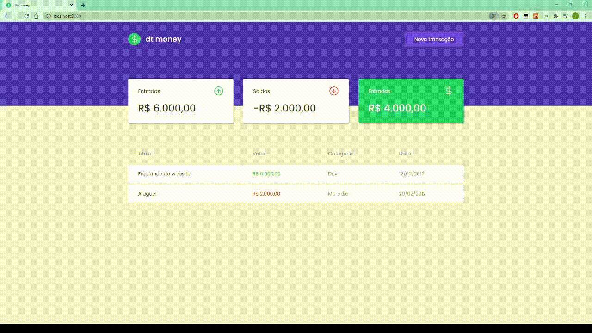
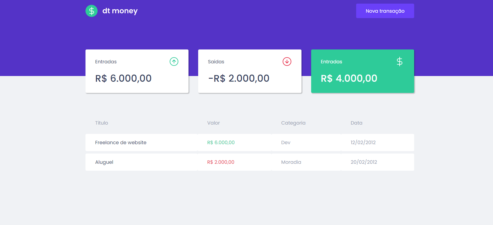
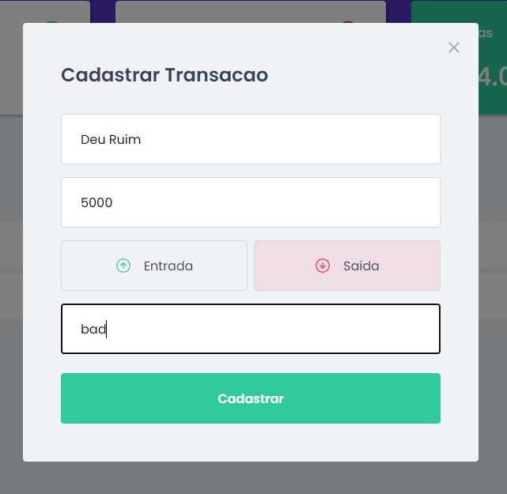
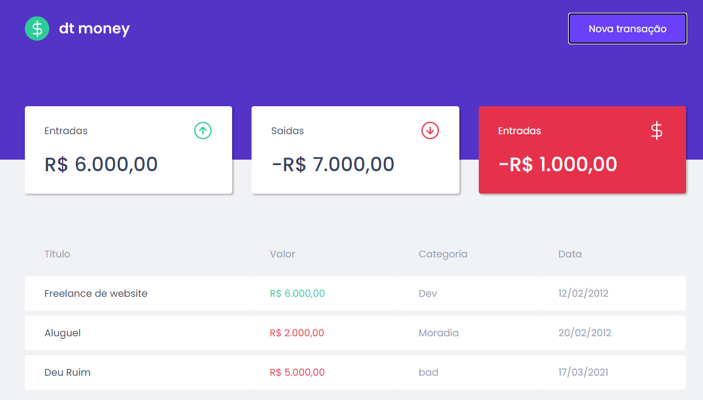

# Modulo 1 Semana 2 - Ignite Trilha ReactJS

_pt-br_

dtMoney, webApp para monitorar carteira de despesas. nao esta no modelo CRUD ainda, contudo ja esta muito funcional. 😎

**Install**

### `yarn install`

Instalar as dependencias do projeto.

### `yarn start`

rodar a App em [http://localhost:3000](http://localhost:3000)

_en-us_

dtMoney, is a webApp for expenses. It isn`t a CRUD,...yet. 😎

**Install**

### `yarn install`

Instalar as dependencias do projeto.

### `yarn start`

rodar a App em [http://localhost:3000](http://localhost:3000)

## Media

## Node version

v14.15.4

## Technoleagues

`ReactJS` | `TypeScript` | `Styled-components` | `Git` | `axios` | `mirageJS ✨` | `polished`
